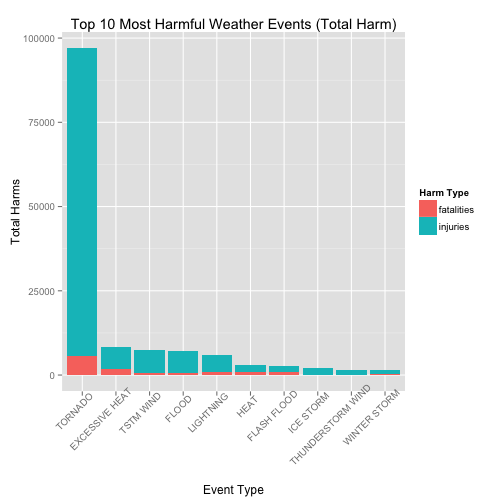
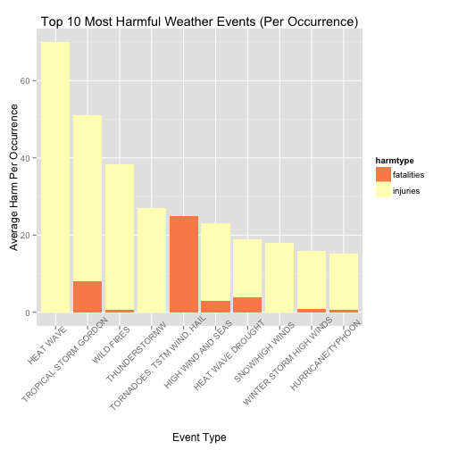
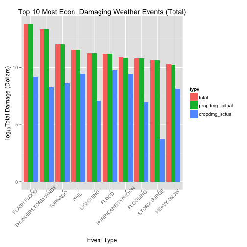
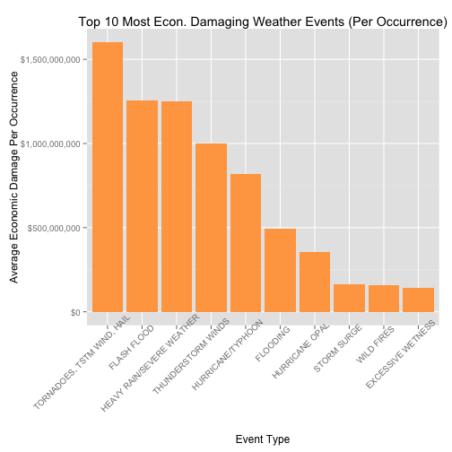

Consequences of Weather Events
==============================


## Synopsis

This analysis explores the human and economic effects of various weather patterns in the United States. Using the U.S. National Oceanic and Atmospheric Administrations's (NOAA) storm database, the analysis involves determining the human harm, measured by fatalities and injuries, and economic damage, measured by property and crop damage, of different types of weather events.

Regarding human harm, we calculated the total fatalities and injuries, respectively, for each weather event type. We then isolated the top 10 weather event types ranked by total harms (fatalities plus injuries). Similarly, we examined the average harm per occurrence of each weather event type.

Regarding economic damage, we calculated the total property damage and crop damage, respectively, for each weather event type. We then isolated the top 10 weather event types ranked by total economic damage (property damage plus crop damage). Similarly, we examined the average amount of economic damage per occurrence of each weather event type. 

## Data Processing

The dataset can be downloaded from the following link:

* [Storm Data](https://d396qusza40orc.cloudfront.net/repdata%2Fdata%2FStormData.csv.bz2) [47Mb]

There is also some documentation of the database available. Here we can find information on how some of the variables are constructed and defined:

* National Weather Service [Storm Data Documentation](https://d396qusza40orc.cloudfront.net/repdata%2Fpeer2_doc%2Fpd01016005curr.pdf)
* National Climate Data Center Storm Events [FAQ](https://d396qusza40orc.cloudfront.net/repdata%2Fpeer2_doc%2FNCDC%20Storm%20Events-FAQ%20Page.pdf)

We begin by checking if the dataset "storm_data.bz2" already exists in a "data/" directory. Otherwise we download the file.

```r
dir <- "data/"
url <- "https://d396qusza40orc.cloudfront.net/repdata%2Fdata%2FStormData.csv.bz2"
datafile <- "storm_data.bz2"

#Check if data directory exists, and if not, create it
if (!file.exists(dir)) {
        dir.create(dir)
}

#Check if data set exists in data directory, and if not, download it from url
if (!file.exists(paste(dir, datafile, sep=""))) {
        download.file(url, paste(dir, datafile, sep=""), method="curl")
}
```
After downloading the data file, we read in the storm data set. When the downloaded file is read the first time, an r object file, "storm_data.rds", will be created to allow future readings to be faster. If the r object file already exists it will be read directly.

```r
robj <- "storm_data.rds"

#Check if data set has already been read in under name 'strm0', otherwise read it in
if (!file.exists(paste(dir, robj, sep=""))) {
        con <- bzfile(paste(dir, datafile, sep=""))
        strm0 <- read.csv(con)
        saveRDS(strm0, paste(dir, robj, sep=""))
} else {
        strm0 <- readRDS(paste(dir, robj, sep=""))
}
```
For easier analysis we quickly format the data set's variable names by making all letters lowercase and removing any underscores.

```r
colnames(strm0) <- tolower(gsub("_", "", colnames(strm0)))
```

## Results 

### 1. Determine which weather events are most harmful to population health.

Before analysis we begin by loading R packages that will aid in working with and plotting the weather data set.

```r
library(dplyr)
library(tidyr)
library(ggplot2)
library(RColorBrewer)
library(scales)
```
We can examine the human harm inflicted by weather events in two ways:

- **A** By calculating the total human harm inflicted by each weather event type
- **B** By calculating the average human harm inflicted by each occurrence of a weather event type.

#### _A. Examine most harmful weather events by total harms._

We will start by calculating the total fatalities and total injuries for each weather event type. Then we order the weather event types by total human harm (fatalities plus injuries). The resulting data frame allows us to determine the relative total harm inflicted by each weather event type. 

```r
#Create new data frame with total fatalities and injuries for each event type
harm_sums <- with(strm0, aggregate(data.frame(fatalities, injuries), list(evtype), sum, na.rm=T))
colnames(harm_sums)[1] <- "evtype"
#Create new variable of total harms (fatalities plus injuries) and arrange data frame from most to fewest harms
harm_sums <- transform(harm_sums, total=fatalities + injuries)
harm_sums <- arrange(harm_sums, desc(total))
```
It is inconvenient to attempt to display the total harms of all weather event types. Instead we isolate the top 10 harmful weather event types and create a plot that allows us to examine how fatalities and injuries contribute to each event's total harm. This plot is displayed below. 

```r
#Select top 10 event types in terms of total harms and combine fatality and injury variables
top10harmsums <- harm_sums[1:10,]
top10harmsums <- gather(top10harmsums, harmtype, number, fatalities, injuries)
top10harmsums <- transform(top10harmsums, evtype=toupper(evtype))
#Create bar graph of total harm for top 10 event types colored by the type of harm(fatality or injury)
harmsumplot <- ggplot(top10harmsums, aes(factor(evtype, evtype[1:10]), number)) + geom_bar(aes(fill=harmtype), stat="identity") +  theme(axis.text.x = element_text(angle=45, hjust=0.8)) + scale_fill_discrete(name="Harm Type") + labs(x="Event Type", y="Total Harms") + ggtitle("Top 10 Most Harmful Weather Events (Total Harm)")
print(harmsumplot)
```

 

#### _B. Examine most harmful weather events by average harm._
An alternative method of examining human harm by weather events is to calculate the average harm inflicted per occurrence of each event. This is done below by first finding the average fatalities and average injuries for each weather event type. Then the weather event types are ordered by the average total harm committed per occurrence (average fatalities plus average injuries).

```r
#Create new data frame with average fatalities and injuries for each event type
harm_means <- with(strm0, aggregate(data.frame(fatalities, injuries), list(evtype), mean, na.rm=T))
colnames(harm_means)[1] <- "evtype"
#Create new variable of average total harms(mean of fatalities plus mean of injuries) and arrange data frame from most to fewest average harms
harm_means <- transform(harm_means, total=fatalities + injuries)
harm_means <- arrange(harm_means, desc(total))
```
Once again it is most convenient to isolate the top 10 harmful weather event types by average. We can then create a plot displaying the results and allowing us to examine the contributions made by average fatalities and average injuries to each average total.

```r
#Select top 10 event types in terms of average total harms and combine fatality and injury variables
top10harmmeans <- harm_means[1:10,]
top10harmmeans <- gather(top10harmmeans, harmtype, number, fatalities, injuries)
top10harmmeans <- transform(top10harmmeans, evtype=toupper(evtype))
#Create bar graph of average harm for top 10 event types colored by the type of harm(fatality or injury)
quartz()
harm_meanplot <- ggplot(top10harmmeans, aes(factor(evtype, evtype[1:10]), number)) + geom_bar(aes(fill=harmtype), stat="identity") + theme(axis.text.x = element_text(angle=45, hjust=0.8)) + scale_fill_discrete(name="Harm Type") + labs(x="Event Type", y="Average Harm Per Occurrence") + scale_fill_manual(values=brewer.pal(3, "Spectral")) + ggtitle("Top 10 Most Harmful Weather Events (Per Occurrence)")
print(harm_meanplot)
```

 

### 2. Determine which weather events are most economically damaging.
Similar to examining human harm, we can evaluate economic damage by weather events in two ways: 

- **A** Total economic damage due to each weather event type. 
- **B** Average economic damage for each occurrence of a weather event type.

The economic damage numbers in the weather data set are split into two types: property damage and crop damage. Each of these values are subsequently represented in two columns: one representing the significant digits and one representing the exponent by which to multiply the significant digits. The following function will be used to convert a significant digit column and exponent column into a single numeric column.

```r
# Function for combining listed damage values and corresponding exponents into single proper numeric value
money_value <- function(x, y) {
        if (y==""|y=="-"|y=="?"|y=="+") {
                x
        }

         else if (tolower(y)=="b") {
                x*1000000000
         }
         else if (tolower(y)=="m") {
                x*1000000
         }
         else if (tolower(y)=="k") {
                x*1000
         }
         else if (tolower(y)=="h") {
                x*100
         }
         else {
                x*10^(as.numeric(y))
         }
}
```
#### _A. Examine most economically damaging weather event by total economic damage._
We begin by using the above-defined _money_value_ function to calculate the proper numeric values for the property damage and crop damage columns. With the proper values we calculate the total property damage and total crop damage for each weather event type. Subsequently, we order the weather event types by total economic damage(property damage plus crop damage).

```r
if (!("propdmg_actual" %in% colnames(strm0))) {
        strm0 <- transform(strm0, propdmg_actual = mapply(money_value, propdmg, propdmgexp), cropdmg_actual = mapply(money_value, cropdmg, cropdmgexp))
        saveRDS(strm0, paste(dir, robj, sep="")) 
}
damage_sums <- with(strm0, aggregate(data.frame(propdmg_actual, cropdmg_actual), list(evtype), sum, na.rm=T))
colnames(damage_sums)[1] <- "evtype"
damage_sums <- transform(damage_sums, total=propdmg_actual + cropdmg_actual)
damage_sums <- arrange(damage_sums, desc(total))
damage_sums <- transform(damage_sums, evtype=toupper(evtype))
```
Once again for convenience, we isolate only the top 10 economically damaging weather event types. Due to the large numeric values and large differences in values between different weather events in the top 10, we decide to plot logarithmic values instead. Also, because of the nature of logarithmic graphs, we must plot the total damage, property damage, and crop damage side by side rather than components of the same bar. This plot is depicted below.

```r
top10damagesums <- damage_sums[1:10,]
top10damagesums <- gather(top10damagesums, type, number, -evtype)
top10damagesums <- transform(top10damagesums, type = factor(type, levels(type)[c(3, 1, 2)]))
quartz()
econsumplot <- ggplot(top10damagesums, aes(factor(evtype, evtype[1:10]), log10(number))) + geom_bar(aes(fill=type), stat="identity", position="dodge") + theme(axis.text.x = element_text(angle=45, hjust=0.8)) + labs(x="Event Type", y=expression(log[10]*"Total Damage (Dollars)")) + ggtitle("Top 10 Most Econ. Damaging Weather Events (Total)")
print(econsumplot)
```

 

#### _B. Examine most economically damaging weather events by average damage per occurrence._
We can also view the economic damage of the weather event types by the average damage inflicted per occurrence. The proper numeric values for property damage and crop damage were calculated previously. With the proper numeric values we find the average property damage and average crop damage for each weather event type and order the events by average total damage(average property damage plus average crop damage).

```r
damage_means <- with(strm0, aggregate(data.frame(propdmg_actual, cropdmg_actual), list(evtype), mean, na.rm=T))
colnames(damage_means)[1] <- "evtype"
damage_means <- transform(damage_means, mean = propdmg_actual + cropdmg_actual)
damage_means <- arrange(damage_means, desc(mean))
damage_means <- transform(damage_means, evtype=toupper(evtype))
```
Again, for convenience we isolate the top 10 economically damaging weather event types by occurrence. We can then plot the average economic damage inflicted by these top 10 events and the contributions made by the average property damage and the average crop damage, respectively.

```r
top10damagemeans <- damage_means[1:10,]
quartz()
econmeanplot <- ggplot(top10damagemeans, aes(factor(evtype, evtype), mean)) + geom_bar(fill="tan1", stat="identity") + theme(axis.text.x = element_text(angle=45, hjust=0.8)) + scale_y_continuous(labels=dollar) + labs(x="Event Type", y="Average Economic Damage Per Occurrence") + ggtitle("Top 10 Most Econ. Damaging Weather Events (Per Occurrence)")
print(econmeanplot)
```

 

